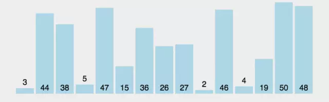

# 思路: 先进行数组排序然后获取中位数

## 排序算法有:

1. 冒泡排序
### 动画

### 算法描述
+ 比较相邻的元素。如果第一个比第二个大，就交换它们两个；
+ 对每一对相邻元素作同样的工作，从开始第一对到结尾的最后一对，这样在最后的元素应该会是最大的数；
+ 针对所有的元素重复以上的步骤，除了最后一个；
+ 重复步骤1~3，直到排序完成。

### 适用场景
冒泡排序思路简单，代码也简单，特别适合小数据的排序。但是，由于算法复杂度较高，在数据量大的时候不适合使用。

### 复杂度
O(n^2)
优化后代码能保证性能最佳时是O(n)

2. 选择排序
### 动画

### 算法描述
+ 在未排序序列中找到最小（大）元素，存放到排序序列的起始位置
+ 从剩余未排序元素中继续寻找最小（大）元素，然后放到已排序序列的末尾。
+ 重复第二步，直到所有元素均排序完毕。

### 适用场景
选择排序实现也比较简单，并且由于在各种情况下复杂度波动小，因此一般是优于冒泡排序的。在所有的完全交换排序中，选择排序也是比较不错的一种算法。但是，由于固有的O(n^2)复杂度，选择排序在海量数据面前显得力不从心。因此，它适用于简单数据排序。

### 复杂度
O(n^2)

3. 插入排序
### 动画

### 算法描述
+ 把待排序的数组分成已排序和未排序两部分，初始的时候把第一个元素认为是已排好序的。
+ 从第二个元素开始，在已排好序的子数组中寻找到该元素合适的位置并插入该位置。
+ 重复上述过程直到最后一个元素被插入有序子数组中。

### 适用场景
插入排序由于O(n^2)的复杂度，在数组较大的时候不适用。但是，在数据比较少的时候，是一个不错的选择，一般做为快速排序的扩充

### 复杂度
O(n^2)

4. 归并排序
5. 快速排序
6. 堆排序
7. 希尔排序
8. 桶排序
9. 基数排序
10. 计数排序
